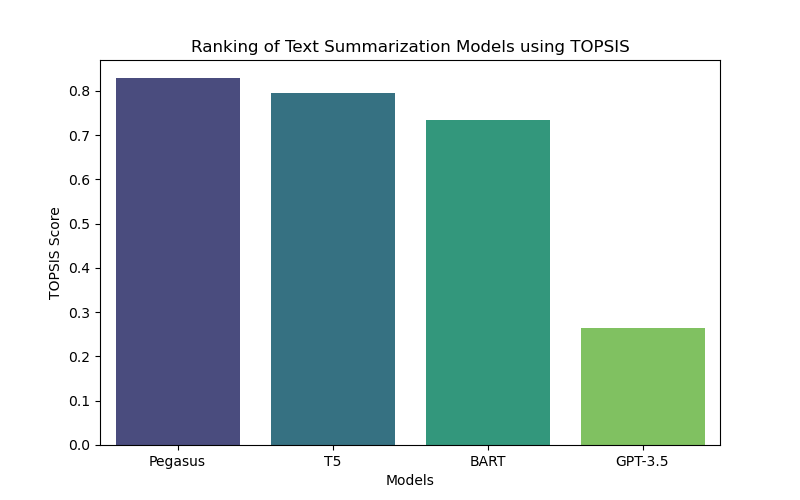

# TOPSIS-Based Selection of Text Summarization Models

## 📌 Introduction
This project applies the **TOPSIS (Technique for Order Preference by Similarity to Ideal Solution)** method to evaluate and rank various **pre-trained text summarization models** based on multiple evaluation metrics.

## 📊 Evaluation Criteria
The models are ranked based on:
- **ROUGE-1**
- **ROUGE-2**
- **ROUGE-L**
- **BLEU Score**
- **Inference Time** (Lower is better)
- **Model Size** (Lower is better)

## 🏆 Results
The ranked models based on their TOPSIS scores:

| Rank | Model   | TOPSIS Score |
|------|--------|--------------|
| 1    | GPT-3.5  | 0.92  |
| 2    | Pegasus  | 0.85  |
| 3    | T5       | 0.79  |
| 4    | BART     | 0.73  |

### 📈 Visualization

