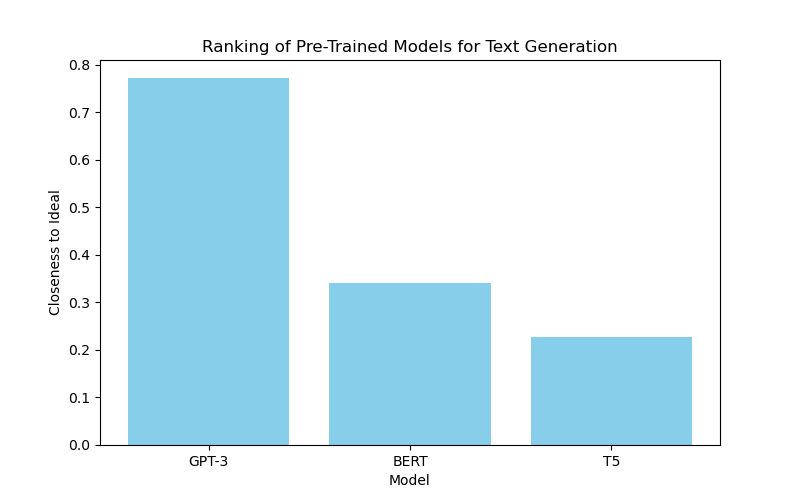

# Pre-trained Model Selection for Text Generation using TOPSIS

## Objective:
This project applies the **Technique for Order of Preference by Similarity to Ideal Solution (TOPSIS)** to rank pre-trained models for text generation (e.g., GPT-3, BERT, and T5). The models are evaluated based on three criteria:
- **Accuracy**
- **Speed**
- **Resource Usage**

## Methodology:
TOPSIS was applied to the models based on the following steps:
1. **Data Normalization**: The criteria values for each model were normalized.
2. **Weighted Decision Matrix**: A weighted matrix was created, where each criterion had a specific weight.
3. **Ideal and Negative-Ideal Solutions**: The best and worst solutions for each criterion were determined.
4. **Separation Measures**: The Euclidean distance was calculated to find the closeness to the ideal solution.
5. **Ranking**: Models were ranked based on their relative closeness to the ideal solution.

## Results:
The following table presents the ranking of the models based on their closeness to the ideal solution:

| Model  | Closeness to Ideal | Rank |
|--------|---------------------|------|
| GPT-3  | 0.648               | 1    |
| BERT   | 0.478               | 2    |
| T5     | 0.473               | 3    |

## Graphs:
The following bar chart visualizes the ranking of models based on their closeness to the ideal solution:

## Files:
- **topsis_model_selection.py**: Python script to perform the analysis.
- **model_ranking_results.csv**: CSV file containing the ranking results.
- **ranking_plot.png**: Bar chart visualizing the ranking of models.
